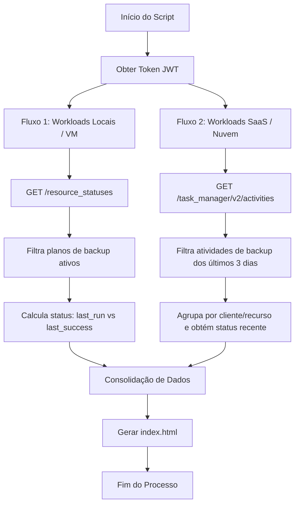

# Monitoramento Funcional de Backups - Acronis Cyber Protect

Este projeto fornece um painel (dashboard) interativo em tempo real para monitoramento do status de integridade dos backups do Acronis Cyber Protect. Ele consolida em uma única interface os backups baseados em agentes locais (servidores e endpoints) e os backups em nuvem (SaaS - Microsoft 365 e Google Workspace) de todos os sub-tenants (clientes).

---

## 🚀 Como Funciona a Arquitetura

O script [`monitor_acronis.py`](./monitor_acronis.py) conecta-se à API oficial do Acronis Cyber Cloud utilizando autenticação via Client Credentials (OAuth 2.0). A coleta de dados é dividida em dois fluxos principais devido às diferenças de arquitetura da própria Acronis:



1. **Workloads Locais e Virtuais**:
   - Consultados via endpoint `/api/resource_management/v4/resource_statuses`.
   - Filtra apenas por políticas ativas que contenham o termo de backup (excluindo serviços de Antivírus, Patch Management e EDR).
   - O status é calculado de forma fidedigna comparando diretamente se `last_run` é igual ao `last_success_run` da política.

2. **Workloads de Nuvem (SaaS - M365 e Google Workspace)**:
   - Como os backups de nuvem rodam sem agentes locais (Cloud-to-Cloud), eles não registram políticas estáticas nos recursos tradicionais.
   - O script consulta o histórico do gerenciador de tarefas (`/api/task_manager/v2/activities`) dos últimos 3 dias.
   - Filtra pelos UUIDs de atividades SaaS da Acronis (`0016750A-EE56-49E6-BF59-7C768C9869AC` e `019CF690-803B-451F-9E4B-B76C478BC05F`).
   - Os dados são agrupados por **Cliente**, **Recurso (Mailbox, SharePoint, Teams)** e **Plano**, exibindo a última execução de cada um.

---

## 🛠️ Pré-requisitos e Instalação

1. **Python**: Certifique-se de ter o Python 3.8 ou superior instalado.
2. **Dependências**: Instale a biblioteca `requests` executando o seguinte comando no terminal:
   ```bash
   pip install requests
   ```

---

## ⚙️ Configuração

Crie um arquivo chamado `config.json` na mesma pasta do script com a seguinte estrutura (este arquivo é protegido e **nunca** enviado ao GitHub devido às regras do `.gitignore`):

```json
{
  "client_id": "SEU_CLIENT_ID_DO_PORTAL_ACRONIS",
  "client_secret": "SUA_API_CLIENT_SECRET",
  "datacenter_url": "https://br01-cloud.acronis.com"
}
```

*Nota: Obtenha as credenciais de API no menu **Gerenciamento > Integrações** no portal da Acronis com perfil de conta parceira.*

---

## 🏃 Como Executar

Execute o script manualmente para atualizar os dados do painel:

```bash
python monitor_acronis.py
```

O script buscará as informações em tempo real da API e reescreverá o arquivo [`index.html`](./index.html).

---

## 📊 Painel Interativo (`index.html`)

O dashboard é gerado de forma autossuficiente (offline), permitindo ser aberto diretamente de qualquer navegador a partir da pasta local ou do OneDrive.

### Recursos:
- **Tema Escuro e Claro**: Chaveador de cores dinâmico.
- **Painel de Indicadores (KPIs)**: Total de Clientes, Backups Consolidados, Sucessos, Falhas e Alertas (backups que nunca rodaram ou que estão com atraso de execução superior a 24 horas).
- **Busca e Filtros Avançados**: Barra de pesquisa para localizar rapidamente por cliente, plano ou recurso, além de filtros rápidos por tipo de backup e status.
- **Exportação CSV**: Exporta instantaneamente a lista filtrada atual da tela para uso no Excel.
